# Customer Churn Prediction Platform

# Exploratory Data Analysis (EDA) Report

---

## Table of Contents

1. Project Overview
2. Objective
3. Dataset Description
4. Dataset Statistics
5. Data Dictionary
6. Data Quality Assessment
7. Initial Observations

---

# 1. Project Overview

Customer churn is one of the most important business metrics for subscription-based companies. Acquiring a new customer is considerably more expensive than retaining an existing one. Therefore, accurately predicting customers who are likely to leave allows businesses to take proactive actions such as providing discounts, personalized offers, or improved customer support.

The goal of this project is to develop a Machine Learning based Customer Churn Prediction Platform capable of predicting whether a customer is likely to churn based on historical customer information and behavioral attributes.

Before building predictive models, it is essential to understand the dataset thoroughly. Exploratory Data Analysis (EDA) helps uncover hidden patterns, detect anomalies, identify important features, and determine appropriate preprocessing techniques.

This report summarizes the complete exploratory analysis performed on the customer churn dataset.

---

# 2. Objective

The primary objectives of this Exploratory Data Analysis are:

- Understand the structure of the dataset.
- Examine the distribution of numerical and categorical variables.
- Analyze the distribution of the target variable.
- Detect missing values and duplicate records.
- Study relationships between customer attributes and churn.
- Identify important features influencing customer churn.
- Discover correlations among numerical features.
- Provide recommendations for feature engineering and preprocessing before model training.

---

# 3. Dataset Description

The dataset contains historical information about customers of a subscription-based service. Each row corresponds to one customer and contains demographic information, subscription details, usage behavior, customer support activity, spending information, and churn status.

The target variable is **Churn**, indicating whether the customer has left the service.

### Dataset Statistics

| Property | Value |
|-----------|------:|
| Number of Records | **64,374** |
| Number of Features | **12** |
| Numerical Features | **9** |
| Categorical Features | **3** |
| Missing Values | **0** |
| Duplicate Records | **0** |
| Target Variable | **Churn** |

---

# 4. Data Dictionary

| Feature | Description | Type |
|----------|-------------|------|
| CustomerID | Unique identifier of each customer | Integer |
| Age | Customer age | Numerical |
| Gender | Male / Female | Categorical |
| Tenure | Number of months customer stayed with the company | Numerical |
| Usage Frequency | Frequency of product/service usage | Numerical |
| Support Calls | Number of customer support calls | Numerical |
| Payment Delay | Delay in bill payment | Numerical |
| Subscription Type | Customer subscription plan | Categorical |
| Contract Length | Duration of subscription contract | Categorical |
| Total Spend | Total amount spent by customer | Numerical |
| Last Interaction | Days since last customer interaction | Numerical |
| Churn | Customer churn status (0 = No, 1 = Yes) | Target Variable |

---

# 5. Data Quality Assessment

Before performing feature analysis, the overall quality of the dataset was evaluated.

## 5.1 Dataset Shape

The dataset consists of:

- **64,374 customer records**
- **12 features**

This dataset is sufficiently large for building reliable machine learning models.

---

## 5.2 Data Types

The dataset contains both numerical and categorical attributes.

### Numerical Features

- CustomerID
- Age
- Tenure
- Usage Frequency
- Support Calls
- Payment Delay
- Total Spend
- Last Interaction
- Churn (Target)

### Categorical Features

- Gender
- Subscription Type
- Contract Length

The data types are correctly assigned, requiring minimal preprocessing.

---

## 5.3 Missing Value Analysis

The dataset contains **no missing values**.

| Metric | Count |
|---------|------:|
| Missing Values | **0** |

### Observation

No imputation techniques are required before model training.

This significantly simplifies the preprocessing pipeline and reduces the possibility of introducing bias through missing-value handling.

---

## 5.4 Duplicate Record Analysis

The dataset contains:

| Metric | Count |
|---------|------:|
| Duplicate Rows | **0** |

### Observation

Each customer record is unique.

No duplicate removal is required before further analysis.

---

## 5.5 Summary Statistics

The numerical variables exhibit the following characteristics:

| Feature | Minimum | Maximum | Mean |
|----------|---------:|---------:|------:|
| Age | 18 | 65 | 41.97 |
| Tenure | 1 | 60 | 31.99 |
| Usage Frequency | 1 | 30 | — |
| Support Calls | 0 | 10 | — |
| Payment Delay | 0 | 30 | — |
| Total Spend | 100 | 1000 | 541.02 |
| Last Interaction | 1 | 30 | 15.50 |

### Key Observations

- Customer ages range from **18 to 65 years**.
- Customer tenure ranges between **1 and 60 months**.
- Total customer spending ranges from **100 to 1000 units**.
- Last interaction values range from **1 to 30 days**.
- Payment delays range between **0 and 30 days**.
- Support calls vary from **0 to 10**.

Overall, the dataset covers a wide range of customer behaviors, making it suitable for predictive modeling.

---

# 6. Initial Observations

Several positive characteristics of the dataset were identified during the initial inspection.

### Strengths

- Large dataset with more than **64,000 observations**.
- No missing values.
- No duplicate records.
- Balanced target variable.
- Combination of demographic, behavioral, financial, and subscription-related features.
- Minimal preprocessing required.

### Potentially Important Features

Based on the feature descriptions, the following variables are expected to influence customer churn significantly:

- Payment Delay
- Support Calls
- Tenure
- Usage Frequency
- Total Spend
- Contract Length

The next sections perform detailed exploratory analysis on each feature individually and study their relationship with customer churn.

---

# 7. Target Variable Analysis

The target variable of this project is **Churn**, where:

- **0** → Customer did **not** churn.
- **1** → Customer **churned**.

Understanding the class distribution is important because highly imbalanced datasets often require resampling techniques such as SMOTE or undersampling before training machine learning models.

---

## 7.1 Churn Distribution


### Dataset Distribution

| Churn Status | Number of Customers | Percentage |
|--------------|-------------------:|-----------:|
| Not Churned (0) | 33,881 | 52.63% |
| Churned (1) | 30,493 | 47.37% |

### Observation

The dataset contains nearly equal numbers of churned and non-churned customers.

There is only a small difference between the two classes.

### Interpretation

The dataset is well balanced and therefore does not suffer from severe class imbalance.

### Business Insight

A balanced dataset improves the reliability of machine learning models and reduces the likelihood of biased predictions toward the majority class.

---

## 7.2 Churn Percentage


### Observation

Approximately half of the customers eventually churn.

### Interpretation

Customer retention is a significant business challenge.

A prediction model capable of identifying customers at risk of churning could substantially improve retention strategies.

---

# 8. Numerical Feature Analysis

The numerical variables were analyzed using:

- Histograms
- Boxplots

Histograms help understand the overall distribution of the data.

Boxplots reveal the spread of the data, median values, quartiles, and potential outliers.

---

# 8.1 Age

## Distribution

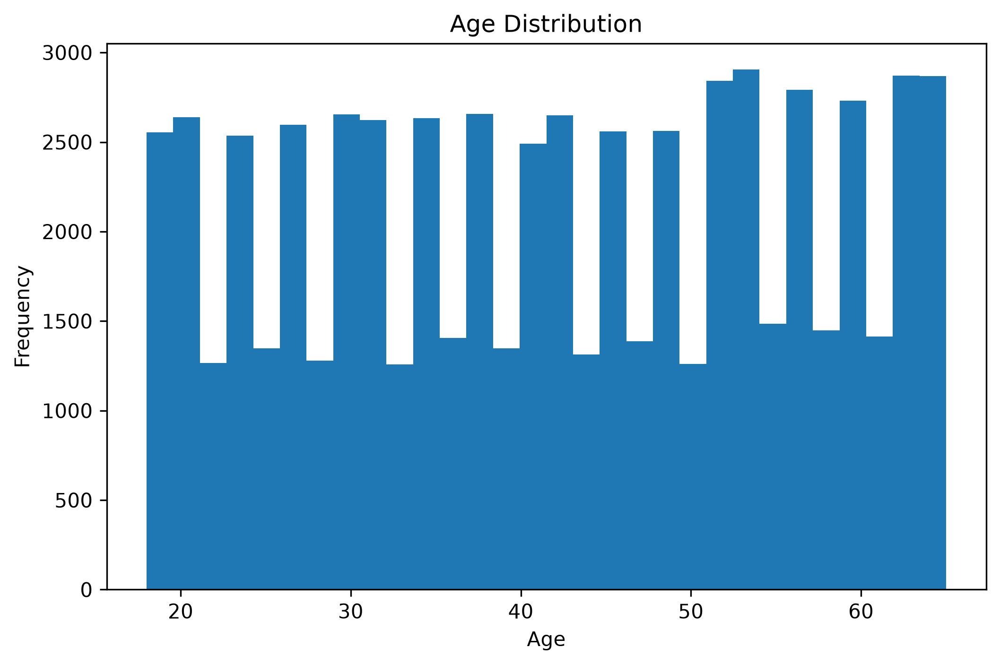

### Observation

Customer ages are distributed relatively uniformly between 18 and 65 years.

The distribution does not exhibit strong skewness.

### Interpretation

The dataset contains customers from multiple age groups, providing good demographic diversity.

---

## Boxplot

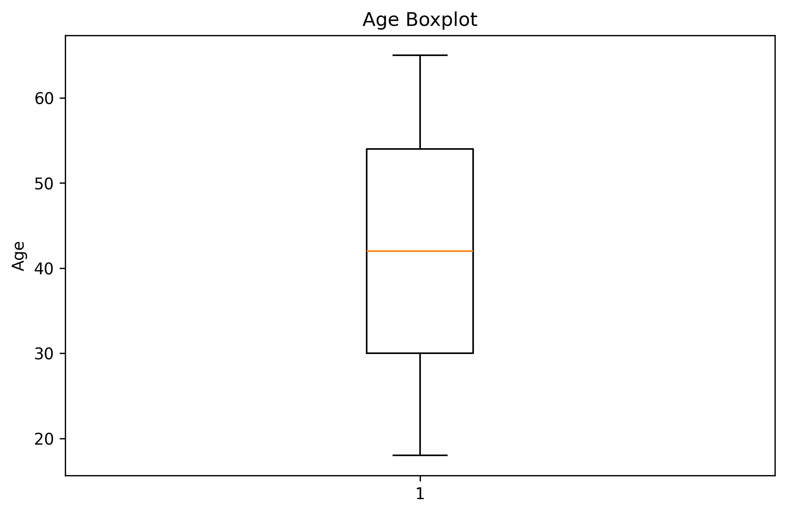

### Observation

Very few extreme observations are present.

The median age is approximately 42 years.

### Interpretation

Age appears to be well distributed and does not require outlier treatment.

---

# 8.2 Tenure

## Distribution

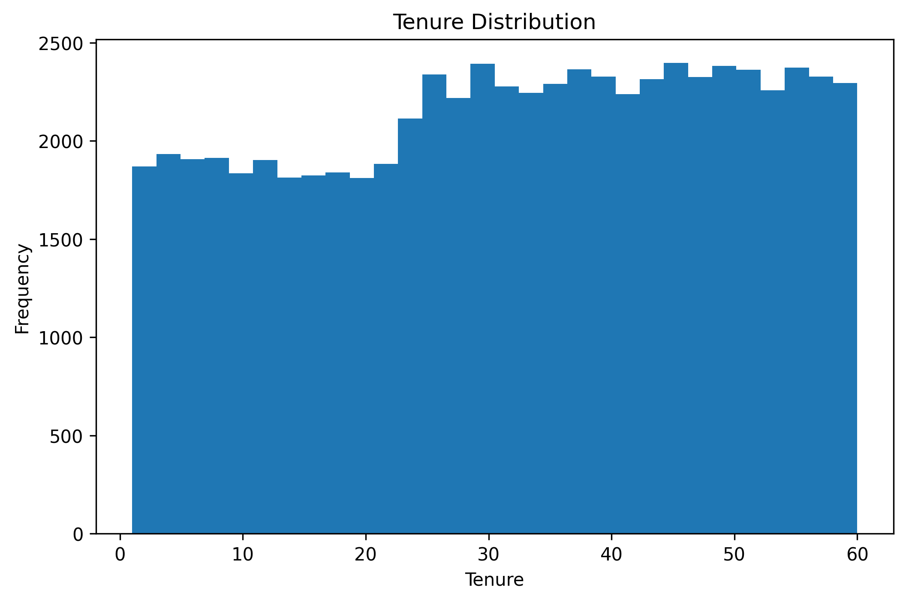

### Observation

Customer tenure ranges from 1 to 60 months.

The distribution is relatively uniform.

### Interpretation

The dataset contains both newly acquired customers and long-term subscribers.

---

## Boxplot

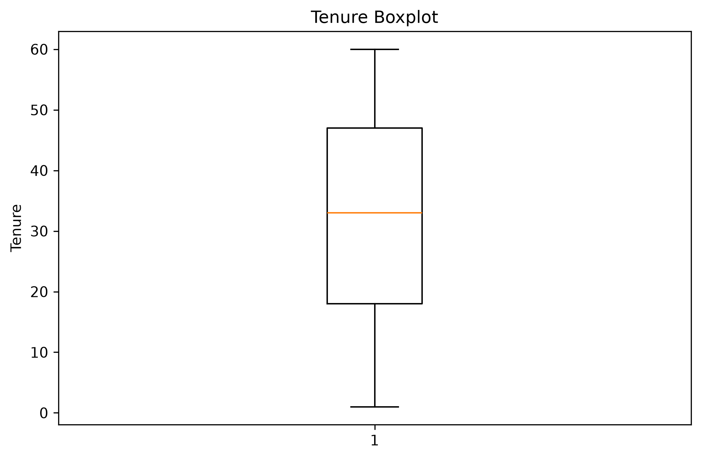

### Observation

No significant outliers are observed.

The median tenure is close to 33 months.

### Interpretation

Tenure is expected to be an important feature during churn prediction.

---

# 8.3 Usage Frequency

## Distribution

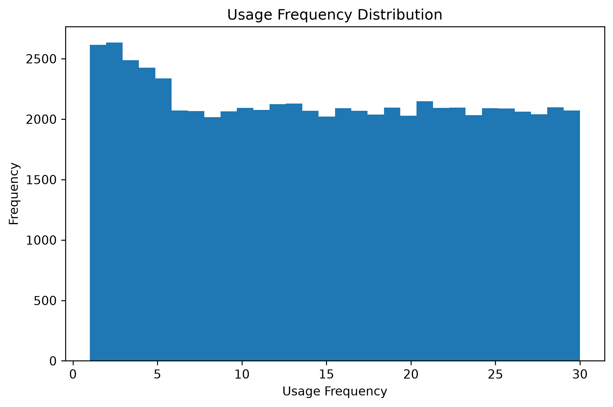

### Observation

Usage Frequency is distributed fairly evenly across its range.

### Interpretation

Customers exhibit varying engagement levels with the service.

Higher engagement may contribute positively to customer retention.

---

## Boxplot

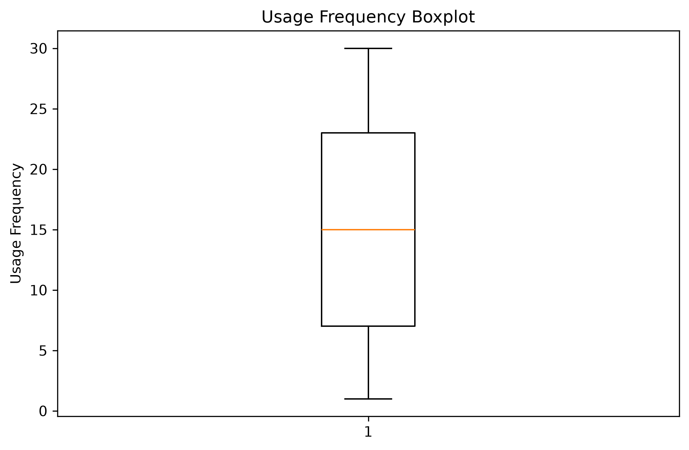

### Observation

No severe outliers are visible.

The feature exhibits a balanced spread.

### Interpretation

Usage Frequency appears suitable for direct use in model training.

---

# 8.4 Support Calls

## Distribution

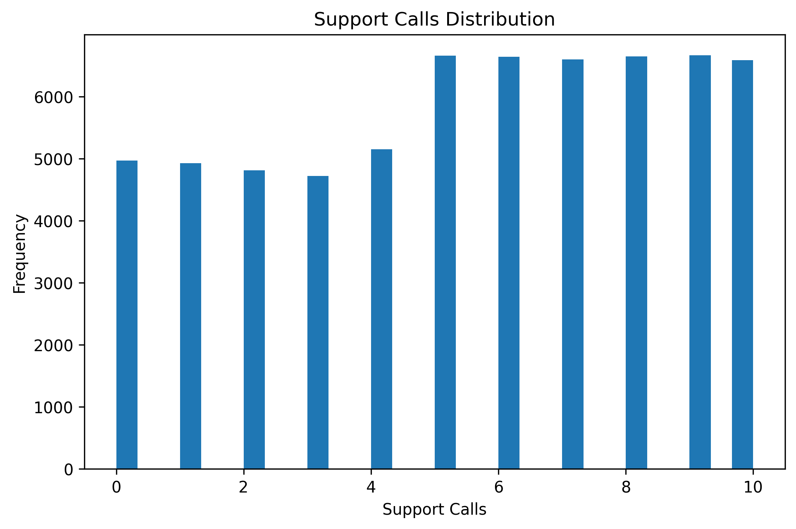

### Observation

Support calls range between 0 and 10.

Most customers make relatively few support calls.

### Interpretation

Frequent support requests may indicate dissatisfaction with the service.

---

## Boxplot

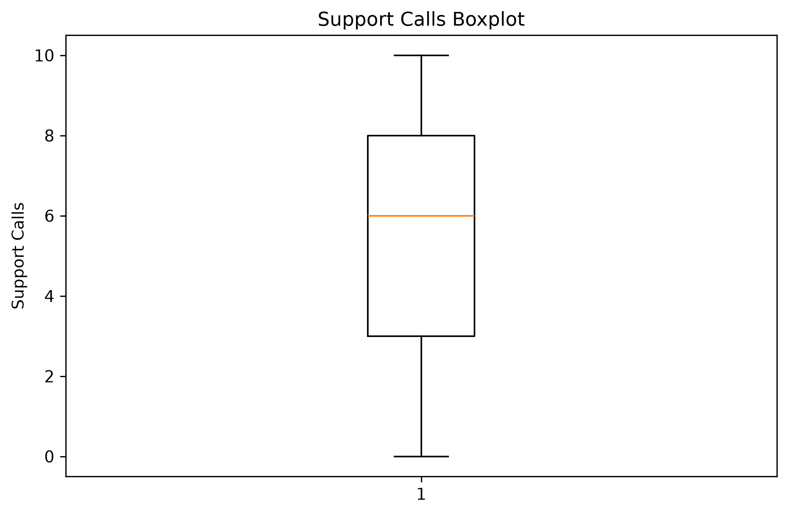

### Observation

The feature has no significant abnormal values.

### Interpretation

Support Calls may serve as an important behavioral indicator of customer satisfaction.

---

# 8.5 Payment Delay

## Distribution

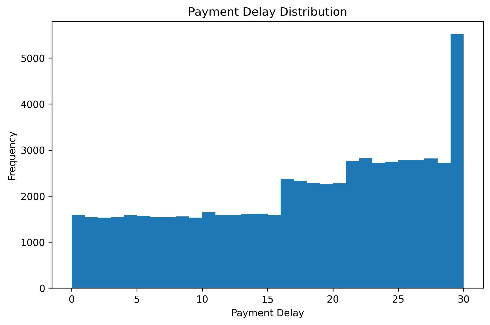

### Observation

Payment delays range from 0 to 30 days.

The distribution covers the complete range without significant skewness.

### Interpretation

Payment behavior varies substantially among customers.

Late payments may indicate financial difficulties or reduced engagement.

---

## Boxplot

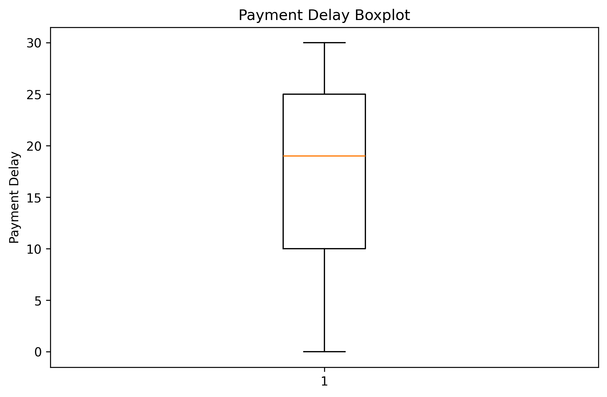

### Observation

The feature exhibits a balanced distribution with minimal outliers.

### Interpretation

Payment Delay is likely to be one of the strongest predictors of churn.

---

# 8.6 Total Spend

## Distribution

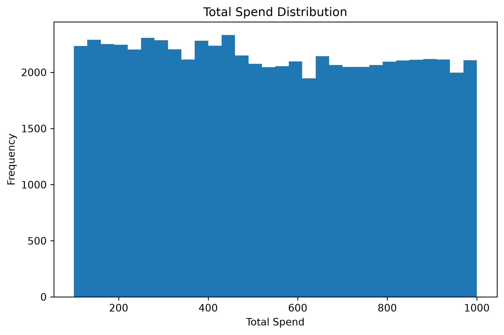

### Observation

Customer spending ranges from 100 to 1000 units.

The distribution is broad and covers customers with both low and high expenditures.

### Interpretation

The dataset represents customers with different purchasing capacities.

---

## Boxplot

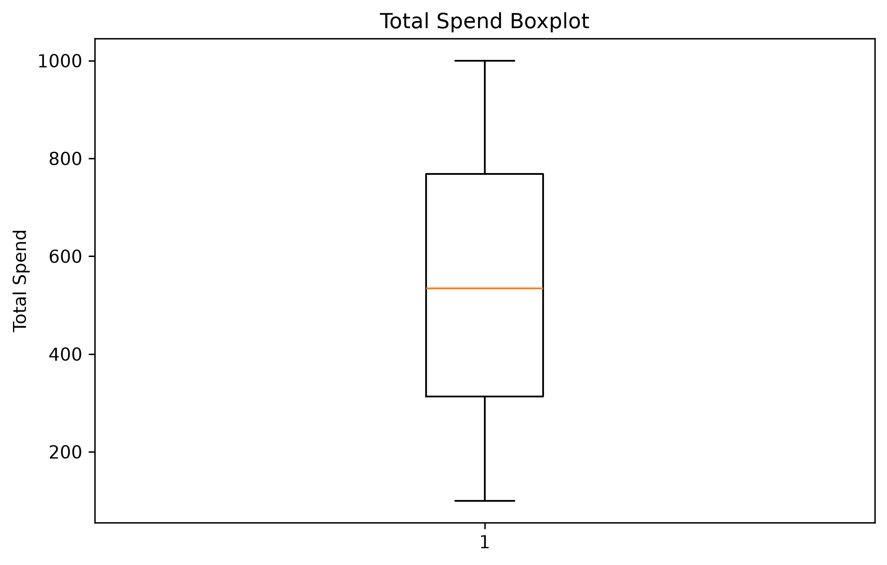

### Observation

No extreme spending outliers are observed.

### Interpretation

Total Spend provides useful financial information while maintaining a stable distribution.

---

# 8.7 Last Interaction

## Distribution

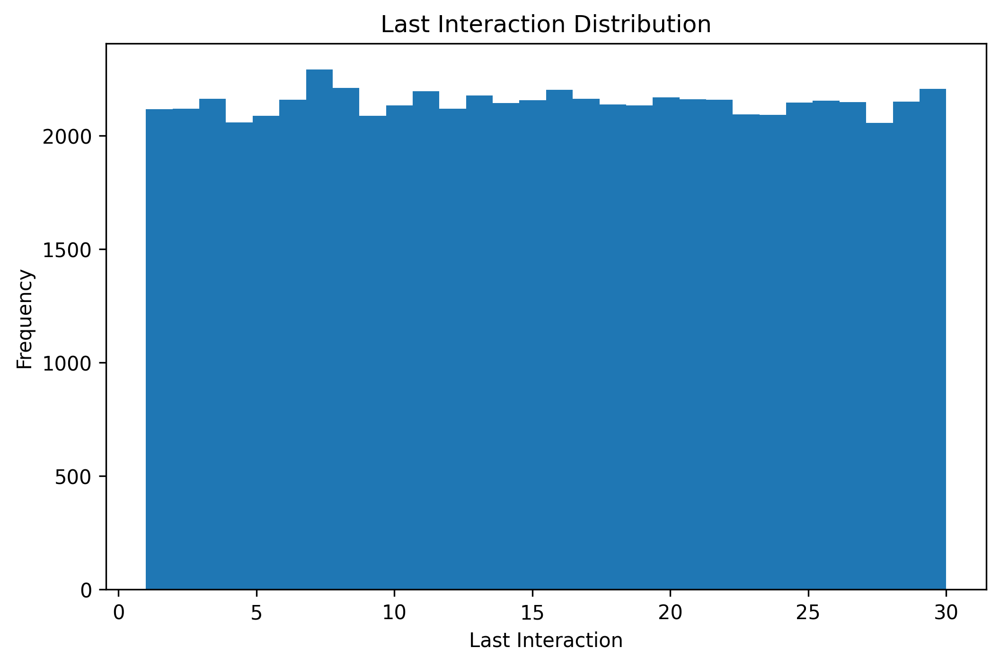

### Observation

Last interaction values range between 1 and 30 days.

The distribution appears approximately uniform.

### Interpretation

Customers have interacted with the company across a broad range of recency values.

---

## Boxplot

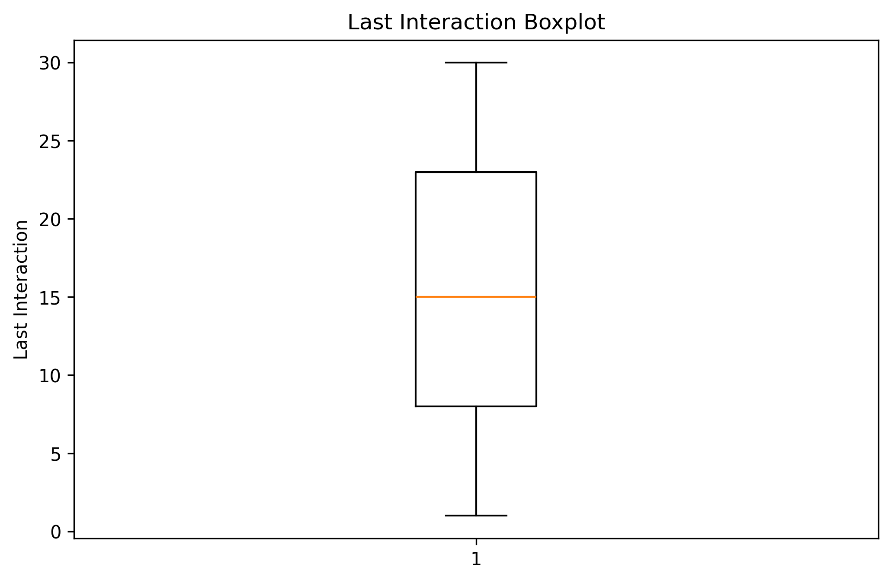

### Observation

No major outliers are detected.

### Interpretation

The feature is clean and suitable for further analysis.

---

# Summary of Numerical Feature Analysis

| Feature | Distribution | Outliers | Expected Importance |
|----------|--------------|----------|---------------------|
| Age | Balanced | Very Few | Medium |
| Tenure | Balanced | No Significant | High |
| Usage Frequency | Balanced | No Significant | High |
| Support Calls | Balanced | Very Few | High |
| Payment Delay | Balanced | Very Few | Very High |
| Total Spend | Balanced | Very Few | Medium |
| Last Interaction | Balanced | No Significant | Medium |

### Overall Findings

- None of the numerical variables exhibit severe outliers.
- Most numerical features have approximately balanced distributions.
- Payment Delay, Support Calls, Tenure, and Usage Frequency appear to be the most promising behavioral indicators for churn prediction.
- Minimal preprocessing is expected before model training.
- Standard feature scaling may be beneficial for distance-based algorithms such as K-Nearest Neighbors and Support Vector Machines.

---


# 9. Categorical Feature Analysis

Categorical variables provide valuable information regarding customer demographics and subscription characteristics. Unlike numerical variables, categorical attributes are analyzed using count plots to understand their distribution across the dataset.

The following categorical features were analyzed:

- Gender
- Subscription Type
- Contract Length

---

# 9.1 Gender

## Distribution

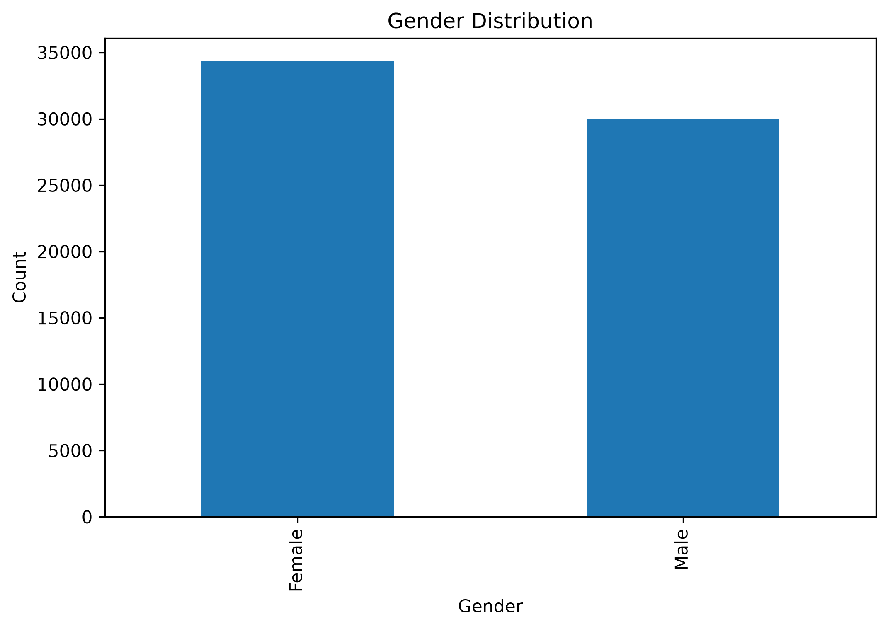

### Observation

The dataset contains a nearly balanced distribution of male and female customers.

### Interpretation

There is no significant gender imbalance in the dataset, which helps reduce potential bias during model training.

---

## Gender vs Churn

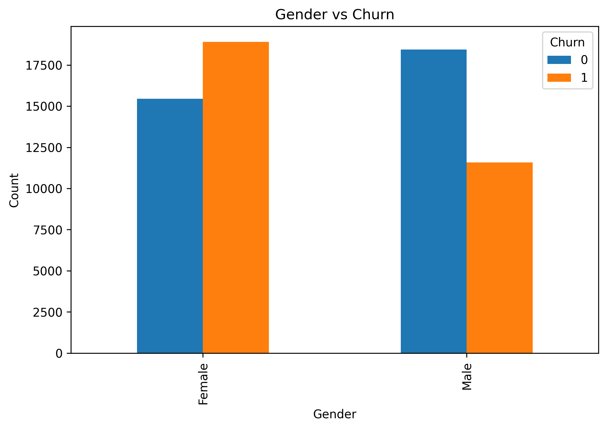

### Observation

Both male and female customers exhibit very similar churn distributions.

### Interpretation

Gender does not appear to be a strong independent predictor of customer churn.

### Business Insight

Customer retention strategies should focus more on customer behavior rather than demographic characteristics such as gender.

---

# 9.2 Subscription Type

## Distribution

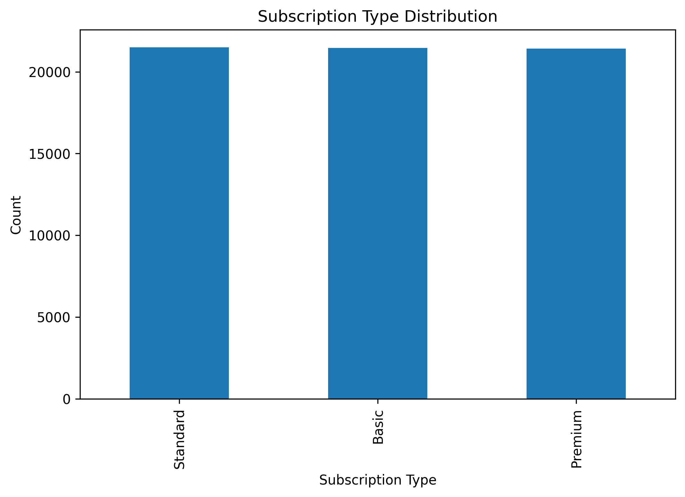

### Observation

Customers are distributed across the three available subscription plans:

- Basic
- Standard
- Premium

The dataset contains a good representation of each subscription category.

### Interpretation

The dataset allows the model to learn customer behavior across different pricing tiers.

---

## Subscription Type vs Churn

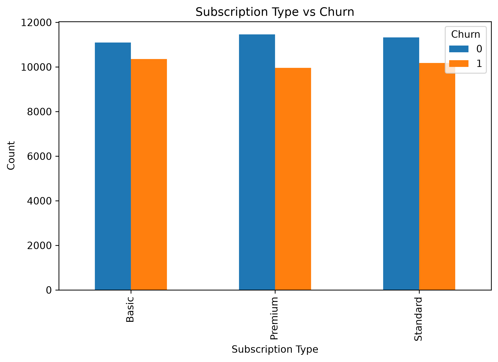

### Observation

All three subscription plans contain both churned and retained customers.

Although the differences are not extremely large, churn behavior varies across subscription categories.

### Interpretation

Subscription Type contributes useful information for churn prediction when combined with other customer attributes.

### Business Insight

Companies can evaluate whether certain subscription plans require additional customer engagement or loyalty incentives.

---

# 9.3 Contract Length

## Distribution

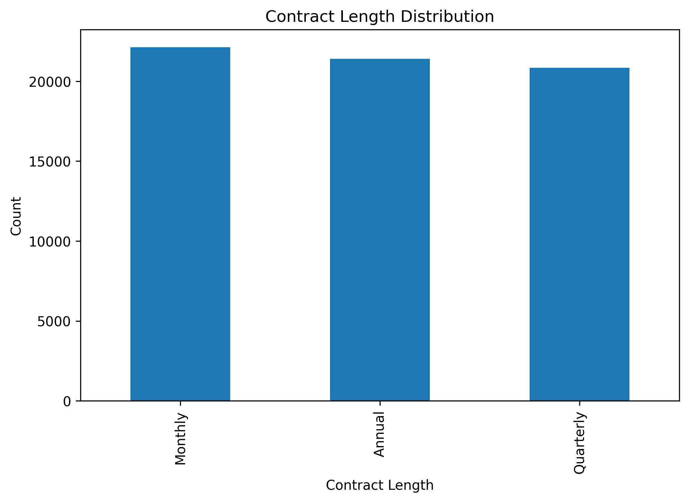

### Observation

Customers are distributed among:

- Monthly
- Quarterly
- Annual

The distribution is relatively balanced.

### Interpretation

Different contract durations provide varying levels of customer commitment.

---

## Contract Length vs Churn

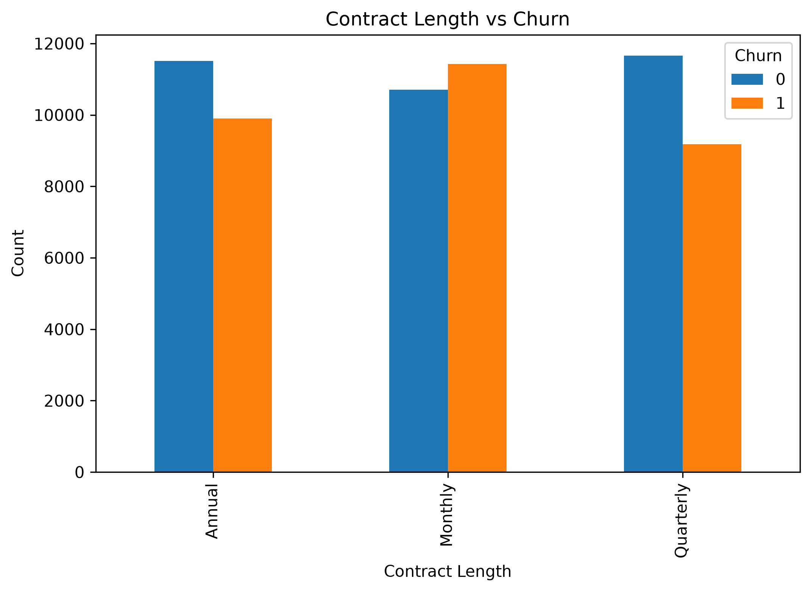

### Observation

Monthly contracts show a noticeably higher number of churned customers compared to Annual contracts.

Annual subscriptions demonstrate comparatively better customer retention.

### Interpretation

Customers with longer contractual commitments are less likely to leave the service.

### Business Insight

Encouraging customers to migrate from monthly plans to longer-duration contracts could significantly reduce churn.

Possible business strategies include:

- Annual subscription discounts
- Loyalty rewards
- Multi-month promotional offers

---

# 10. Feature vs Target Analysis

This section investigates how each numerical feature behaves for churned and retained customers.

The comparison is performed using boxplots grouped by the target variable.

---

# 10.1 Age vs Churn

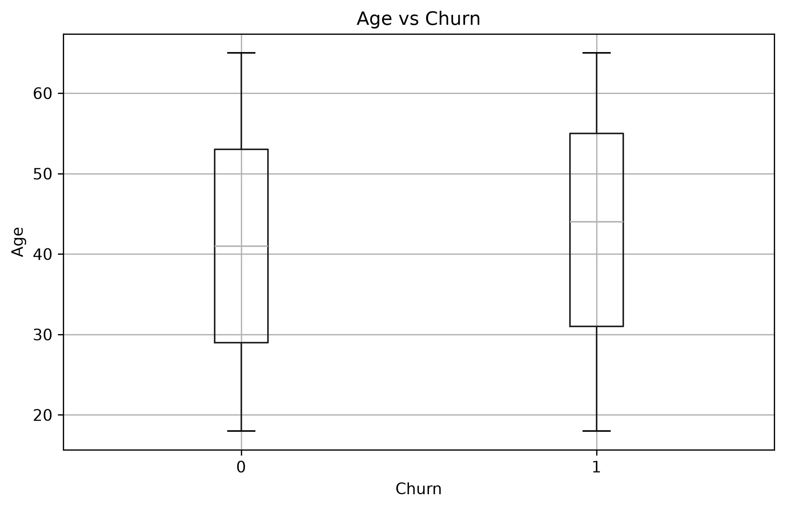

### Observation

Customers who churn have a slightly higher median age.

However, the distributions overlap considerably.

### Interpretation

Age alone is not sufficient for predicting churn.

### Conclusion

Age contributes limited predictive information and should be combined with behavioral features.

---

# 10.2 Tenure vs Churn

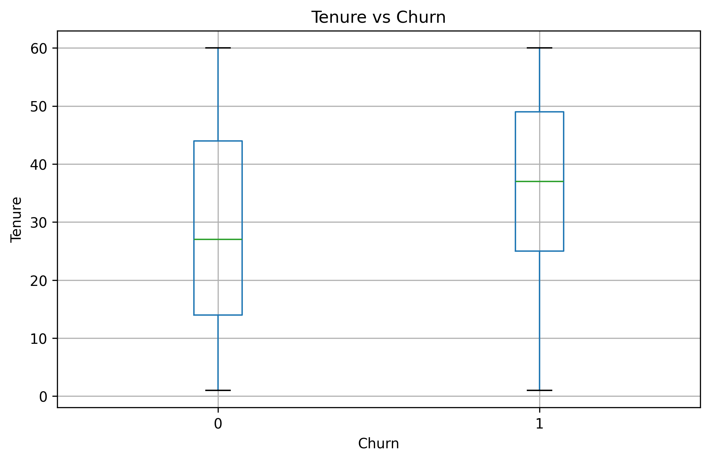

### Observation

Customers who churn generally exhibit higher tenure values.

### Interpretation

Long-term customers may also churn if their expectations are no longer satisfied.

### Conclusion

Tenure should be retained as an important predictive feature.

---

# 10.3 Usage Frequency vs Churn

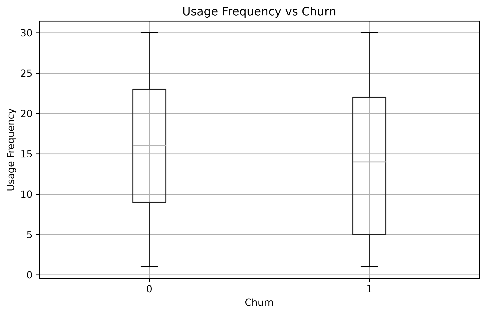

### Observation

Churned customers generally display lower usage frequency.

### Interpretation

Reduced product engagement often precedes customer churn.

### Business Insight

Customers with declining activity should receive proactive engagement campaigns.

---

# 10.4 Support Calls vs Churn

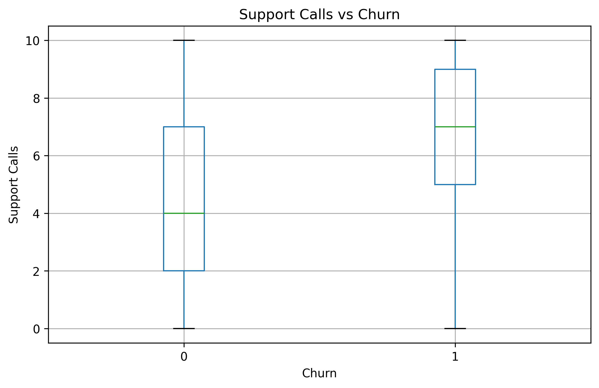

### Observation

Customers who churn make noticeably more support calls.

### Interpretation

Frequent support requests indicate dissatisfaction or unresolved issues.

### Business Insight

Improving customer support quality may significantly improve customer retention.

---

# 10.5 Payment Delay vs Churn

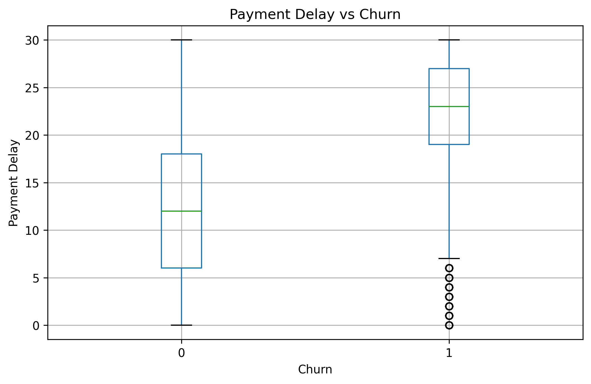

### Observation

Payment delays are substantially higher among churned customers.

The separation between the two groups is clearly visible.

### Interpretation

Payment behavior appears to be one of the strongest indicators of customer churn.

### Business Insight

Customers with increasing payment delays should be prioritized for retention campaigns.

---

# 10.6 Total Spend vs Churn

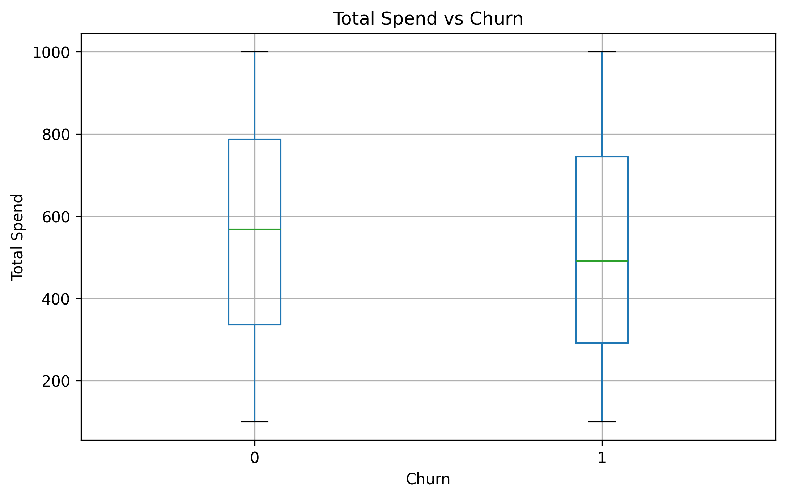

### Observation

Total spending distributions are relatively similar for both customer groups.

### Interpretation

Total Spend alone is not a dominant predictor of churn.

### Conclusion

Its predictive power is expected to increase when combined with behavioral variables.

---

# 10.7 Last Interaction vs Churn

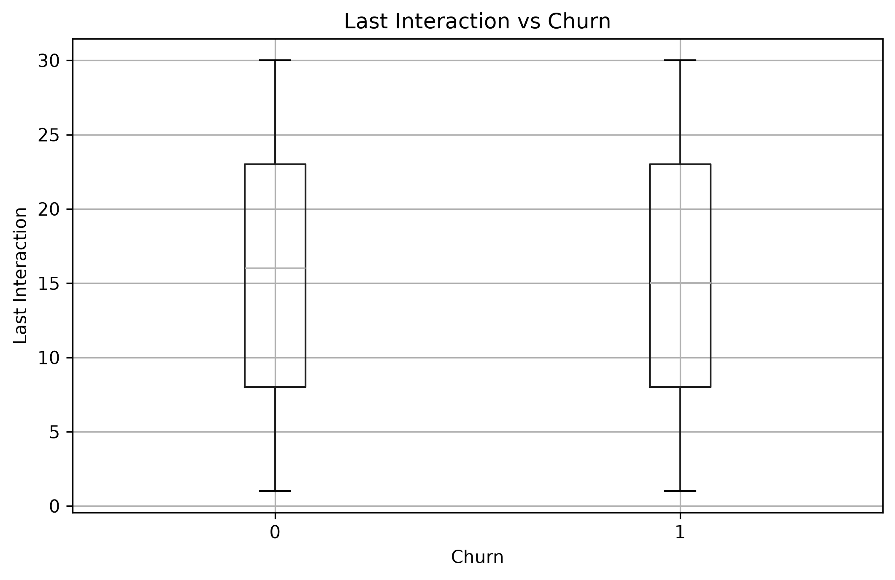

### Observation

Both groups exhibit very similar distributions.

### Interpretation

Last Interaction has limited standalone predictive capability.

### Conclusion

The feature should still be retained because it may contribute useful information in combination with other variables.

---

# 11. Correlation Analysis

Correlation analysis helps identify relationships among numerical variables and detect multicollinearity.

A Pearson correlation matrix was computed for all numerical features.

---

## Correlation Heatmap


### Observation

The correlation matrix indicates generally weak to moderate correlations among the numerical variables.

No pair of features exhibits extremely high correlation.

### Key Findings

- CustomerID does not provide meaningful predictive information and should be removed before training.
- Payment Delay exhibits one of the strongest positive relationships with churn.
- Support Calls also shows a positive relationship with churn.
- Usage Frequency demonstrates a weak negative relationship with churn.
- Most numerical variables are largely independent.

### Interpretation

Low multicollinearity is beneficial because each feature contributes unique information to the prediction model.

### Business Insight

Behavioral variables such as:

- Payment Delay
- Support Calls
- Usage Frequency
- Tenure

appear considerably more informative than demographic variables.

These features are expected to contribute most to the predictive performance of machine learning models.

---

# Summary of Feature Importance (Based on EDA)

| Feature | Expected Importance |
|----------|--------------------|
| Payment Delay | ⭐⭐⭐⭐⭐ |
| Support Calls | ⭐⭐⭐⭐⭐ |
| Tenure | ⭐⭐⭐⭐ |
| Usage Frequency | ⭐⭐⭐⭐ |
| Contract Length | ⭐⭐⭐⭐ |
| Subscription Type | ⭐⭐⭐ |
| Total Spend | ⭐⭐⭐ |
| Last Interaction | ⭐⭐ |
| Age | ⭐⭐ |
| Gender | ⭐ |

### Overall Findings

The exploratory analysis suggests that **customer behavior** is a much stronger indicator of churn than **customer demographics**.

Behavioral features related to payment habits, service usage, customer support interactions, and subscription characteristics are expected to contribute most significantly to churn prediction.

This insight will guide the preprocessing stage and the selection of machine learning models in the subsequent phases of the project.

---

# 12. Key Business Insights

The exploratory analysis revealed several important business insights that can help organizations proactively reduce customer churn and improve customer retention.

---

## Insight 1: Payment Delay is the Strongest Indicator of Churn

Customers with higher payment delays exhibit a noticeably greater tendency to churn.

### Business Impact

Delayed payments often indicate:

- Financial difficulties
- Reduced customer engagement
- Lower customer satisfaction

### Recommended Action

The company should:

- Send automated payment reminders.
- Offer flexible payment options.
- Provide grace periods for loyal customers.
- Introduce early payment incentives.

---

## Insight 2: Frequent Support Calls Increase Churn Probability

Customers who contacted customer support more frequently were significantly more likely to churn.

### Business Impact

A high number of support calls generally indicates:

- Product dissatisfaction
- Technical issues
- Poor customer experience

### Recommended Action

Improve:

- Customer support response time.
- First-contact resolution rate.
- Quality of technical support.
- Self-service knowledge base.

Reducing customer frustration can directly improve retention.

---

## Insight 3: Customer Engagement Plays a Major Role

Customers with lower product usage tend to churn more frequently.

### Business Impact

Lower engagement often represents declining customer interest before cancellation.

### Recommended Action

Develop customer engagement campaigns such as:

- Personalized recommendations
- Email reminders
- Loyalty rewards
- Usage milestone achievements
- Product tutorials

---

## Insight 4: Contract Length Influences Retention

Customers with Annual contracts exhibit lower churn compared to Monthly contracts.

### Business Impact

Longer commitments improve customer retention.

### Recommended Action

Encourage migration toward longer contracts through:

- Annual subscription discounts
- Loyalty benefits
- Exclusive premium features
- Renewal incentives

---

## Insight 5: Demographic Features Have Limited Predictive Power

Features such as:

- Gender
- Age

show relatively small differences between churned and retained customers.

### Business Impact

Behavioral information is significantly more valuable than demographic information for churn prediction.

### Recommended Action

Business strategies should primarily target customer behavior rather than demographic segmentation.

---

# 13. Data Preprocessing Recommendations

Based on the findings from the exploratory analysis, the following preprocessing steps are recommended before training machine learning models.

---

## 13.1 Remove Unnecessary Features

The **CustomerID** column is a unique identifier and does not contain predictive information.

### Action

Remove:

- CustomerID

---

## 13.2 Encode Categorical Variables

Machine learning algorithms require numerical inputs.

The following categorical variables should be encoded:

| Feature | Recommended Encoding |
|----------|----------------------|
| Gender | Label Encoding |
| Subscription Type | One-Hot Encoding |
| Contract Length | One-Hot Encoding |

---

## 13.3 Feature Scaling

Certain machine learning algorithms perform better when numerical features are standardized.

Recommended scaling methods:

- StandardScaler
- MinMaxScaler (if required)

Scaling is especially beneficial for:

- Logistic Regression
- Support Vector Machine (SVM)
- K-Nearest Neighbors (KNN)

Tree-based models such as Random Forest and XGBoost generally do not require feature scaling.

---

## 13.4 Train-Test Split

The dataset should be divided into:

- Training Set (80%)
- Testing Set (20%)

A fixed random state should be used to ensure reproducibility.

---

## 13.5 Feature Selection

Based on the EDA findings, the following features are expected to contribute most to predictive performance:

- Payment Delay
- Support Calls
- Usage Frequency
- Tenure
- Contract Length
- Subscription Type

These features should be prioritized during model development.

---

# 14. Machine Learning Strategy

Following preprocessing, multiple classification algorithms will be trained and evaluated.

The planned models include:

| Model | Purpose |
|--------|----------|
| Logistic Regression | Baseline Linear Model |
| Decision Tree | Simple Interpretable Model |
| Random Forest | Ensemble Learning |
| XGBoost | Gradient Boosting |
| LightGBM (Optional) | High-Performance Gradient Boosting |

Model evaluation will be based on:

- Accuracy
- Precision
- Recall
- F1 Score
- ROC-AUC Score
- Confusion Matrix

The best-performing model will be selected for deployment.

---

```md
## 15. Future Improvements

Possible future enhancements include:

- Support real-time customer churn prediction through a web interface.
- Enable bulk predictions using CSV file uploads.
- Add an interactive analytics dashboard for business insights.
- Optimize model performance using hyperparameter tuning.
- Deploy the application on a cloud platform for public access.

---


# References

1. Scikit-learn Documentation  
   https://scikit-learn.org/

2. Pandas Documentation  
   https://pandas.pydata.org/

3. Matplotlib Documentation  
   https://matplotlib.org/

4. NumPy Documentation  
   https://numpy.org/

5. Customer Churn Prediction Dataset  
   Kaggle

---

# End of Report