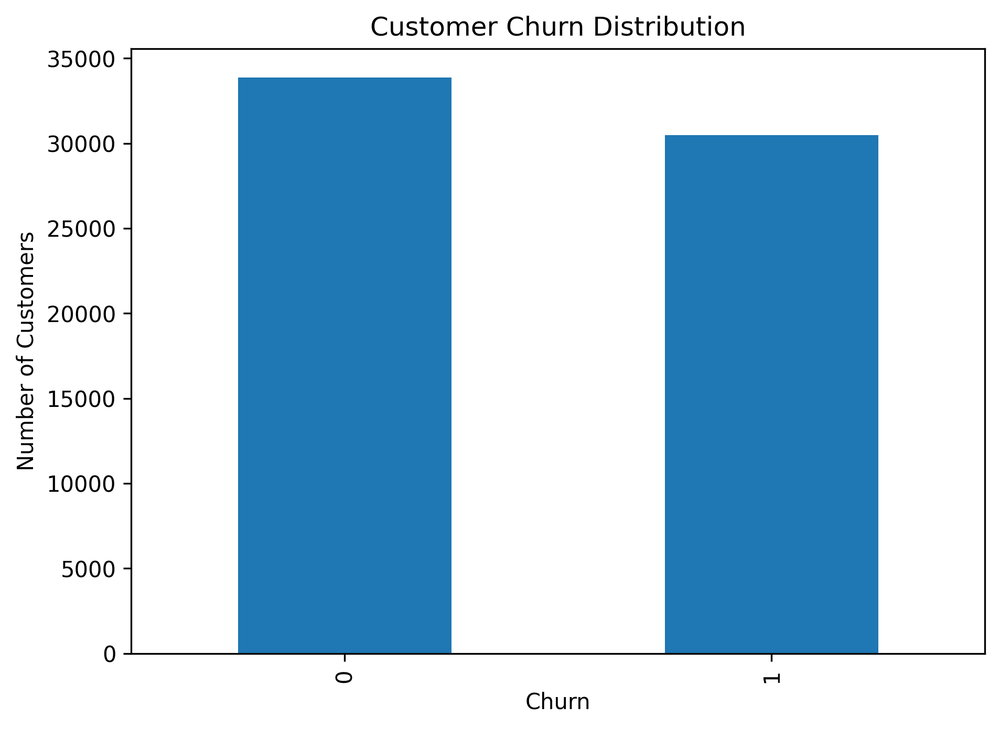
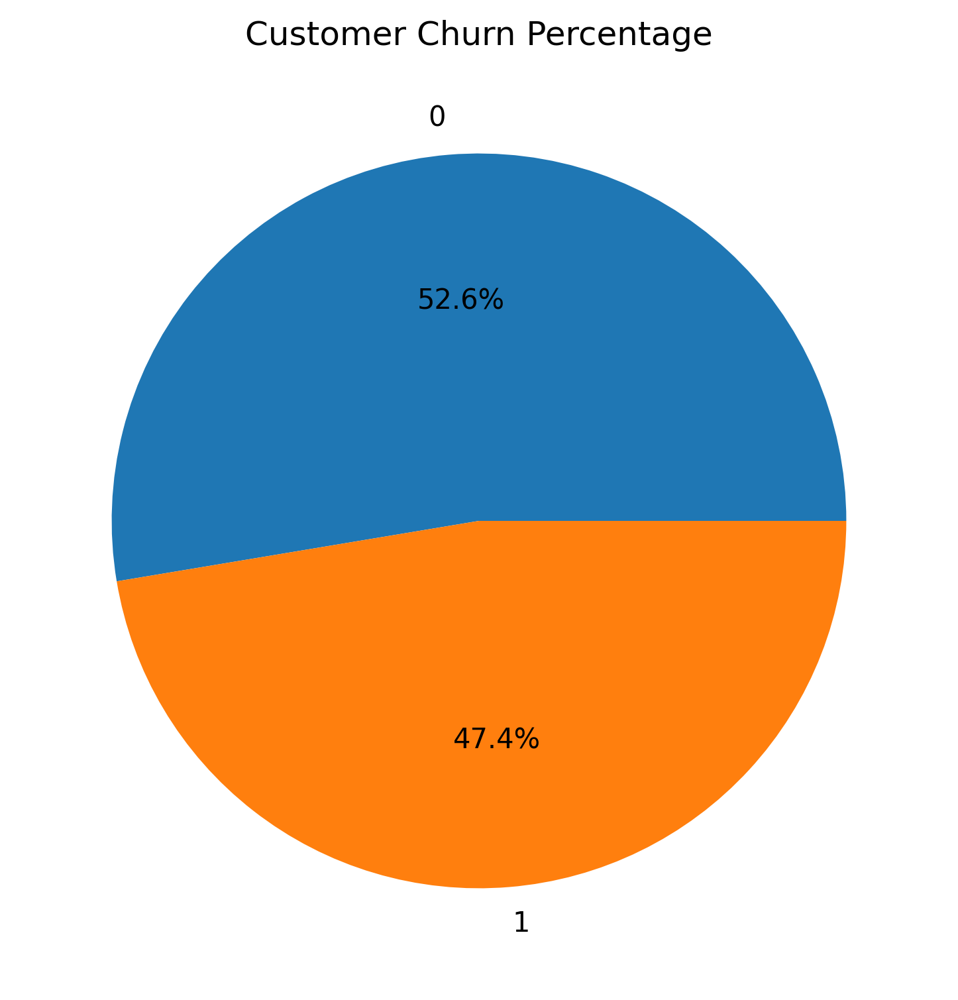
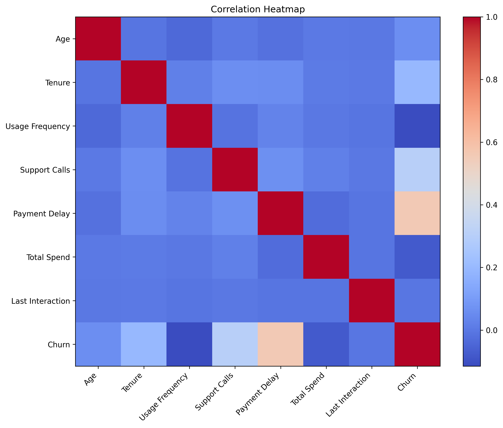

# Customer Churn Prediction Platform

# Exploratory Data Analysis (EDA) Report

---

# 1. Project Overview

This report presents the Exploratory Data Analysis (EDA) performed on the Customer Churn dataset. The objective of the analysis is to understand the dataset, evaluate its quality, identify important patterns, and determine the preprocessing steps required before training machine learning models.

EDA provides insights into customer demographics, subscription details, service usage, payment behavior, and customer support interactions, helping identify the factors that most influence customer churn.

---

# 2. Objectives

The main objectives of this analysis are:

- Understand the dataset structure.
- Assess data quality.
- Analyze the target variable.
- Study numerical and categorical features.
- Identify relationships between customer attributes and churn.
- Examine feature correlations.
- Recommend preprocessing techniques for model development.

---

# 3. Dataset Description

The dataset contains customer information collected from a subscription-based service. Each record represents one customer and includes demographic information, subscription details, usage behavior, spending information, and churn status.

### Dataset Summary

| Property | Value |
|-----------|------:|
| Records | **64,374** |
| Features | **12** |
| Numerical Features | **9** |
| Categorical Features | **3** |
| Missing Values | **0** |
| Duplicate Records | **0** |
| Target Variable | **Churn** |

### Features

| Feature | Description |
|----------|-------------|
| CustomerID | Unique customer identifier |
| Age | Customer age |
| Gender | Customer gender |
| Tenure | Months with the company |
| Usage Frequency | Service usage frequency |
| Support Calls | Number of support requests |
| Payment Delay | Payment delay in days |
| Subscription Type | Current subscription plan |
| Contract Length | Subscription duration |
| Total Spend | Total customer spending |
| Last Interaction | Days since last interaction |
| Churn | Target variable |

---

# 4. Data Quality Assessment

The dataset was examined to ensure it is suitable for machine learning. Overall, the data is clean, complete, and requires minimal preprocessing.

## Dataset Summary

| Metric | Value |
|--------|------:|
| Records | **64,374** |
| Features | **12** |
| Numerical Features | **9** |
| Categorical Features | **3** |
| Missing Values | **0** |
| Duplicate Records | **0** |

### Numerical Features

- CustomerID
- Age
- Tenure
- Usage Frequency
- Support Calls
- Payment Delay
- Total Spend
- Last Interaction
- Churn

### Categorical Features

- Gender
- Subscription Type
- Contract Length

## Summary Statistics

| Feature | Minimum | Maximum | Mean |
|----------|---------:|---------:|------:|
| Age | 18 | 65 | 41.97 |
| Tenure | 1 | 60 | 31.99 |
| Total Spend | 100 | 1000 | 541.02 |
| Last Interaction | 1 | 30 | 15.50 |

### Key Findings

- No missing values were found.
- No duplicate records were detected.
- Data types are correctly assigned.
- Numerical features have reasonable ranges without abnormal values.
- The dataset is clean and suitable for model development with only minimal preprocessing required.

---

# 5. Target Variable Analysis

The target variable **Churn** indicates whether a customer has discontinued the service. Since this is a binary classification problem, understanding the class distribution is important before model training.

## Churn Distribution

The bar chart shows the number of customers belonging to each class (Churn = 0 and Churn = 1).

### Observations

- The dataset contains two classes representing customers who stayed and customers who churned.
- The class distribution is nearly balanced.
- No severe class imbalance is observed.
- A balanced dataset allows machine learning models to learn both classes effectively without requiring oversampling or undersampling techniques.

---

## Churn Percentage

The pie chart illustrates the proportion of customers who churned compared to those who remained.

### Key Findings

- Both classes are well represented in the dataset.
- Evaluation metrics such as Accuracy, Precision, Recall, F1 Score, and ROC-AUC can be interpreted reliably.
- The balanced distribution reduces the risk of bias toward the majority class during model training.

---

## Conclusion

The target variable is well balanced, making the dataset suitable for supervised binary classification without additional class-balancing techniques.

---

# 6. Numerical Feature Analysis

The numerical features describe customer demographics, service usage, payment behaviour and spending patterns. Histograms and boxplots were used to examine their distributions and identify potential outliers.

## Distribution Plots

The following figures illustrate the distributions of all numerical features.

- Age Distribution
- Tenure Distribution
- Usage Frequency Distribution
- Support Calls Distribution
- Payment Delay Distribution
- Total Spend Distribution
- Last Interaction Distribution

*(Insert the generated histograms here.)*

## Boxplots

Boxplots were used to detect outliers and understand the spread of each numerical feature.

*(Insert the generated boxplots here.)*

### Key Observations

- Most numerical features follow realistic value ranges.
- No missing values or abnormal distributions were observed.
- A few extreme observations exist but remain within acceptable business limits.
- Feature scaling is recommended because the numerical variables have different ranges.

---

# 7. Categorical Feature Analysis

Three categorical variables were analyzed to understand the distribution of customer groups.

- Gender
- Subscription Type
- Contract Length

The following count plots summarize the distribution of each category.

*(Insert the generated count plots here.)*

### Key Observations

- Both genders are well represented.
- Customers are distributed across all subscription plans.
- Contract lengths include monthly, quarterly and annual plans with meaningful variation.
- No invalid or unexpected category values were found.

---

# 8. Feature vs Target Analysis

The relationship between customer characteristics and churn was examined using grouped boxplots and categorical count plots.

### Numerical Features vs Churn

The following boxplots compare numerical features across churn classes.

*(Insert the generated numerical feature vs churn boxplots here.)*

### Categorical Features vs Churn

The following count plots compare categorical features across churn classes.

*(Insert the generated categorical feature vs churn plots here.)*

### Key Findings

- Customers with shorter tenure are generally more likely to churn.
- Higher payment delays and more support calls are associated with increased churn.
- Usage frequency and total spending also show noticeable differences between churned and retained customers.
- Subscription type and contract length influence churn behaviour, indicating that customer plans contribute to retention.

---

# 9. Correlation Analysis

A correlation heatmap was generated to examine the linear relationships between numerical features and the target variable.

### Key Observations

- Most numerical features exhibit weak to moderate correlations, indicating limited multicollinearity.
- CustomerID has no predictive value and should be excluded from model training.
- Features such as **Tenure**, **Usage Frequency**, **Support Calls**, **Payment Delay**, and **Total Spend** show meaningful relationships with customer churn.
- The absence of strong correlations among predictor variables suggests that each feature contributes unique information to the machine learning models.

---

# 10. Key Business Insights

The exploratory data analysis revealed several important patterns related to customer churn.

- Customers with shorter tenure are more likely to discontinue the service.
- Frequent support calls are associated with a higher probability of churn.
- Customers with longer payment delays exhibit increased churn rates.
- Subscription type and contract length influence customer retention.
- Total spending and usage frequency provide valuable indicators of customer engagement.
- The dataset is balanced and contains no missing or duplicate records, making it well suited for supervised machine learning.

---

# 11. Data Preprocessing Recommendations

Based on the exploratory analysis, the following preprocessing steps were applied before model training:

- Remove the **CustomerID** column, as it does not contribute to prediction.
- Apply **Label Encoding** to categorical variables.
- Standardize numerical features using **StandardScaler**.
- Perform a stratified train-test split to preserve class distribution.
- Use cross-validation to improve model robustness.
- Apply hyperparameter tuning to optimize model performance.
- Calibrate predicted probabilities using sigmoid calibration for improved probability estimates.

---

# 12. Conclusion

The exploratory data analysis confirmed that the dataset is clean, balanced, and suitable for customer churn prediction. No missing values or duplicate records were detected, and the selected features provide meaningful information for predicting customer behavior.

The insights obtained during EDA guided the preprocessing strategy and supported the development of robust machine learning models. After preprocessing, multiple supervised learning algorithms were evaluated, with a calibrated Random Forest classifier selected as the final deployed model due to its strong predictive performance and reliable probability estimates.

Overall, the EDA established a solid foundation for building an accurate and dependable customer churn prediction system.